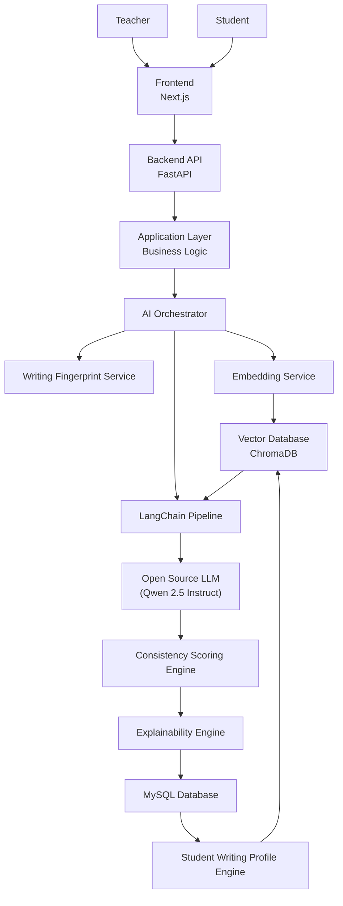
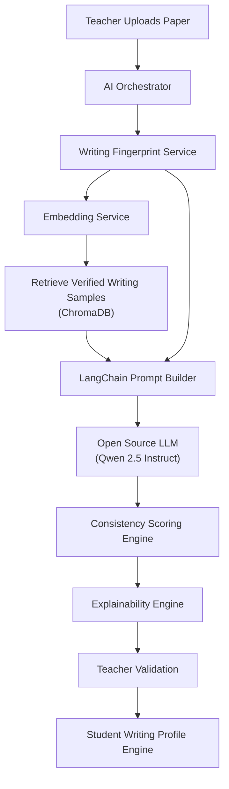

# Chapter 2 - System Architecture & AI Architecture

# 2.1 System Overview

WritOath follows a layered architecture that separates the presentation layer, application layer, artificial intelligence services, and data storage. This modular architecture promotes maintainability, scalability, and separation of concerns, allowing each layer to focus on a specific responsibility.

The system begins with teacher interaction through the web application, where verified writing samples and student submissions are uploaded. Requests are handled by the backend application, which delegates all AI-related processing to a centralized AI Orchestrator. The orchestrator coordinates feature extraction, semantic retrieval, language model inference, scoring, and explanation generation before returning structured analysis results to the application layer.

Unlike conventional AI detection systems, WritOath performs authorship verification by comparing new submissions exclusively against the student's verified writing profile, ensuring that every analysis is personalized and context-aware.

---

# 2.2 Architectural Principles

The architecture of WritOath is guided by the following design principles.

### Student-Centered Analysis

Every analysis is based solely on the student's verified writing profile instead of generalized writing datasets or external knowledge.

### Explainable Artificial Intelligence

Every consistency score is accompanied by a detailed explanation describing the factors that influenced the analysis.

### Retrieval Before Reasoning

The system retrieves the student's most relevant verified writing samples before invoking the language model. This ensures that all reasoning is grounded in verified student data.

### Human-in-the-Loop Validation

Teachers remain the final authority in determining document authenticity. Their validated decisions are incorporated into the student's writing profile to improve future analyses.

### Modular AI Services

Each AI component performs a single responsibility, making the system easier to maintain, extend, and replace as technologies evolve.

---

# 2.3 High-Level System Architecture

---

# 2.4 Architecture Description

## Presentation Layer

The Presentation Layer is developed using Next.js and provides teachers with interfaces for managing students, subjects, verified writing samples, paper submissions, and analysis results.

Its responsibility is limited to user interaction and communication with the backend through RESTful APIs.

---

## Application Layer

The Application Layer is implemented using FastAPI and serves as the central entry point for all system operations.

Its responsibilities include:

- Authentication
- Teacher management
- Student management
- Subject management
- Paper management
- Baseline management
- Request validation
- Business rule enforcement

Rather than executing AI operations directly, the application layer delegates all analysis requests to the AI Orchestrator.

---

## AI Orchestrator

The AI Orchestrator is the central coordinator of the entire artificial intelligence workflow.

Instead of embedding AI logic throughout the backend, the orchestrator manages the execution order of all AI services and consolidates their outputs into a unified analysis result.

Its responsibilities include:

- Initiating feature extraction
- Generating semantic embeddings
- Retrieving verified writing samples
- Constructing Retrieval-Augmented Generation (RAG) prompts
- Invoking the language model
- Coordinating scoring and explanation generation
- Returning structured analysis results to the application layer

This design improves maintainability, follows the Single Responsibility Principle, and simplifies future enhancements to the AI pipeline.

---

# 2.5 AI Architecture

The WritOath AI architecture combines deterministic stylometric analysis with Retrieval-Augmented Generation (RAG).

Rather than relying solely on a language model, the system first retrieves the student's verified writing samples from the vector database and provides them as contextual knowledge for comparison.

This approach ensures that every analysis is grounded exclusively in the student's historical writing.

---

## AI Processing Pipeline

---

# 2.6 AI Components

## Writing Fingerprint Service

The Writing Fingerprint Service extracts measurable stylometric characteristics from every document.

These include writing attributes such as sentence complexity, vocabulary diversity, punctuation usage, paragraph organization, readability, and other linguistic features.

These objective measurements complement the semantic reasoning performed by the language model.

---

## Embedding Service

The Embedding Service converts documents into dense vector representations that capture their semantic meaning.

These embeddings are generated for both verified writing samples and newly submitted papers and are stored within the vector database for similarity retrieval.

---

## Vector Database (ChromaDB)

ChromaDB stores the embeddings of all verified writing samples.

When a new paper is submitted, it retrieves the most semantically relevant writing samples belonging to the same student.

These retrieved documents become the contextual knowledge used during analysis.

---

## LangChain Pipeline

LangChain orchestrates the Retrieval-Augmented Generation process.

Its responsibilities include:

- Retrieving relevant writing samples from ChromaDB
- Constructing structured prompts
- Injecting contextual information into the language model
- Managing communication with the language model
- Returning structured responses

This ensures that the language model reasons only over trusted, student-specific information.

---

## Open Source Language Model

The language model performs contextual authorship analysis by comparing the submitted paper with the retrieved verified writing samples.

Instead of attempting to detect AI-generated text, the model evaluates whether the submission is consistent with the student's established writing identity.

The recommended implementation uses **Qwen 2.5 Instruct**, although the architecture allows alternative open-source instruction-tuned models to be substituted with minimal changes.

---

## Consistency Scoring Engine

The Consistency Scoring Engine transforms the language model's observations into structured numerical outputs.

The generated analysis includes:

- Overall Consistency Score
- Confidence Level
- Category Breakdown
- Writing Pattern Comparison

These quantitative metrics provide educators with interpretable indicators of writing consistency.

---

## Explainability Engine

The Explainability Engine converts technical analysis into natural-language explanations.

Rather than presenting only numerical scores, it highlights the similarities and differences observed between the student's historical writing and the submitted paper.

This transparency supports teacher trust and informed decision-making.

---

## Student Writing Profile Engine

The Student Writing Profile Engine manages each student's evolving writing identity.

Initially, the profile is established using verified writing samples.

As teachers validate future submissions, the profile may be updated through versioning, allowing the system to adapt to natural improvements in writing while preserving historical profile data.

---

# 2.7 Data Storage Architecture

WritOath utilizes two complementary storage systems.

## MySQL Database

MySQL serves as the primary relational database for storing structured application data, including:

- Teacher records
- Student records
- Subjects
- Papers
- Feature metadata
- Consistency scores
- Teacher feedback
- Student writing profiles

MySQL acts as the system's primary source of truth for application data.

---

## ChromaDB

ChromaDB functions as the vector database responsible for storing semantic embeddings of verified writing samples.

Its sole responsibility is supporting semantic retrieval during Retrieval-Augmented Generation.

By separating vector storage from relational data, the system maintains clear boundaries between structured application data and AI retrieval data.

---

# 2.8 Request Lifecycle

The following sequence summarizes the complete authorship verification workflow.

1. A teacher uploads a new student paper through the web application.
2. The request is received and validated by the FastAPI backend.
3. The Application Layer delegates the request to the AI Orchestrator.
4. The Writing Fingerprint Service extracts stylometric features from the document.
5. The Embedding Service generates a semantic embedding.
6. ChromaDB retrieves the student's most relevant verified writing samples.
7. LangChain constructs a Retrieval-Augmented Generation prompt using the retrieved writing samples and extracted writing features.
8. The open-source language model evaluates the consistency between the submitted paper and the student's historical writing.
9. The Consistency Scoring Engine computes structured scores and confidence values.
10. The Explainability Engine generates a human-readable explanation.
11. The analysis result is stored in MySQL and returned to the teacher.
12. The teacher reviews the analysis and records a final decision.
13. Teacher-validated submissions may be incorporated into the Student Writing Profile Engine, allowing the student's writing profile to evolve over time.