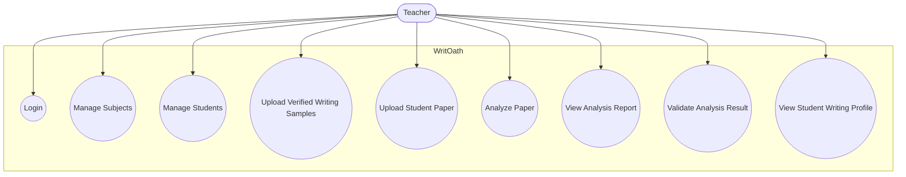
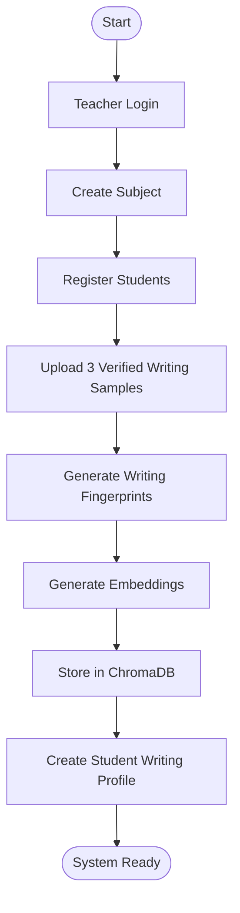
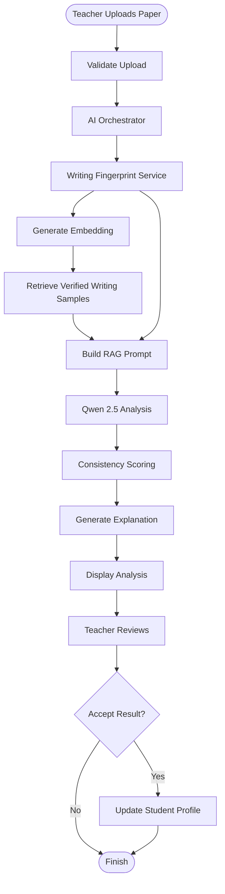
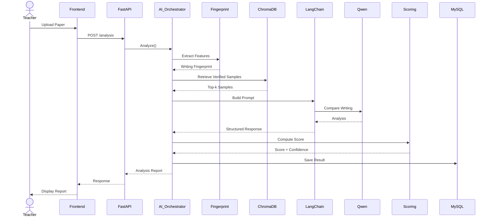
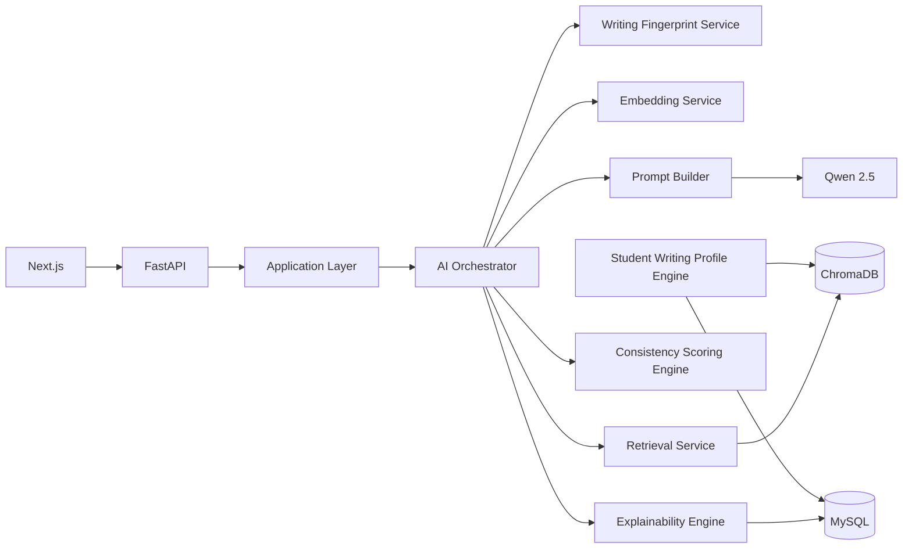
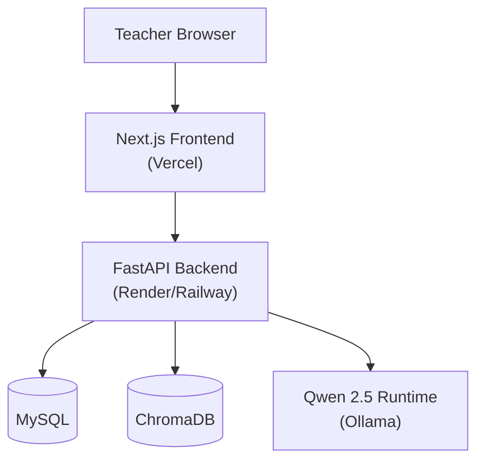

# Chapter 3 – System Analysis and Design

# 3.1 Use Case Diagram

The Use Case Diagram illustrates the interactions between the primary users of WritOath and the system's core functionalities. It identifies the services available to each actor and defines the system's functional scope.

During the initial release, WritOath supports a single primary actor:

- **Teacher**

Although administrators may be introduced in future versions, teacher users are responsible for all operational tasks within the system.

The Teacher can perform the following functions:

- Authenticate into the system
- Manage subjects
- Manage students
- Upload verified writing samples
- Submit student papers for analysis
- View analysis reports
- Validate analysis results
- View student writing profiles

---

# 3.2 Activity Diagrams

Activity diagrams model the flow of control for the system's primary business processes.

Each activity diagram captures the sequence of actions, decision points, and outputs associated with a specific use case.

The following workflows are included:

| Activity Diagram | Purpose |
| --- | --- |
| Teacher Registration | Registers a new teacher account and initializes the system. |
| Student Management | Adds and manages student records under subjects. |
| Verified Writing Sample Upload | Registers the student's initial writing profile using verified documents. |
| Paper Analysis | Performs authorship verification using the AI pipeline. |
| Teacher Validation | Records the teacher's final decision after reviewing the AI analysis. |
| Student Writing Profile Update | Updates the student's writing profile using teacher-validated submissions. |

---

# 3.3 Sequence Diagrams

Sequence diagrams describe the chronological interaction between system components during a given process.

Unlike activity diagrams, sequence diagrams emphasize communication between actors, backend services, databases, and AI components.

The following sequence diagrams are included:

| Sequence Diagram | Purpose |
| --- | --- |
| Teacher Registration | Registers a new teacher account. |
| Upload Verified Writing Samples | Stores verified documents and initializes the student's writing profile. |
| Analyze Student Paper | Executes the complete AI pipeline from upload to report generation. |
| Teacher Validation | Saves teacher feedback and final verdict. |
| Student Writing Profile Update | Updates the writing profile after validation. |

---

# 3.4 Component Diagram

The Component Diagram illustrates the internal software modules that compose WritOath and the dependencies between them.

Unlike the architectural overview presented in Chapter 2, this diagram focuses on the logical organization of the application's software components.

Major components include:

- Next.js Frontend
- FastAPI Backend
- Application Layer
- AI Orchestrator
- Writing Fingerprint Service
- Embedding Service
- LangChain Pipeline
- Consistency Scoring Engine
- Explainability Engine
- Student Writing Profile Engine
- MySQL Database
- ChromaDB Vector Database
- Open-Source Language Model

---

# 3.5 Deployment Diagram

The Deployment Diagram illustrates the physical infrastructure required to deploy WritOath.

The system consists of:

- Client Browser
- Next.js Web Application
- FastAPI Backend
- MySQL Database
- ChromaDB Vector Database
- Open-Source LLM Runtime

This deployment architecture separates presentation, application logic, AI processing, and persistence into independent layers, allowing each component to scale independently.

---

# 3.6 System Workflows

System workflows describe the end-to-end execution of the major processes within WritOath.

Unlike activity diagrams, workflows combine business logic and system behavior into a single implementation-oriented description.

The documented workflows include:

### Initial System Setup

- Teacher registration
- Subject creation
- Student registration
- Verified writing sample upload

---

### Paper Analysis Workflow

- Teacher uploads student paper
- AI Orchestrator coordinates the analysis
- Writing Fingerprint Service extracts stylometric features
- Embedding Service generates document embeddings
- ChromaDB retrieves the student's verified writing samples
- LangChain constructs the Retrieval-Augmented Generation context
- Open-source language model performs authorship comparison
- Consistency Scoring Engine computes evaluation metrics
- Explainability Engine generates the analysis report
- Results are presented to the teacher

---

### Teacher Validation Workflow

- Teacher reviews the generated report
- Teacher records the final verdict
- Feedback is stored in the database

---

### Student Writing Profile Evolution

- Teacher-approved submissions are evaluated for inclusion
- Student Writing Profile Engine updates the student's profile through versioning
- Future analyses use the updated profile for comparison