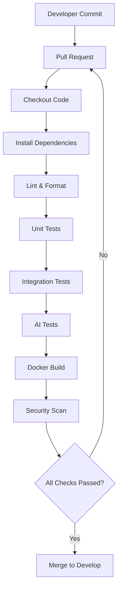
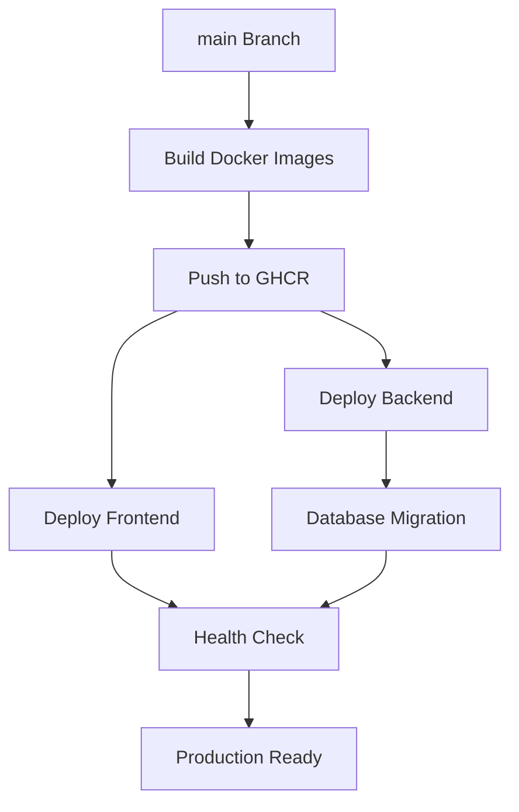
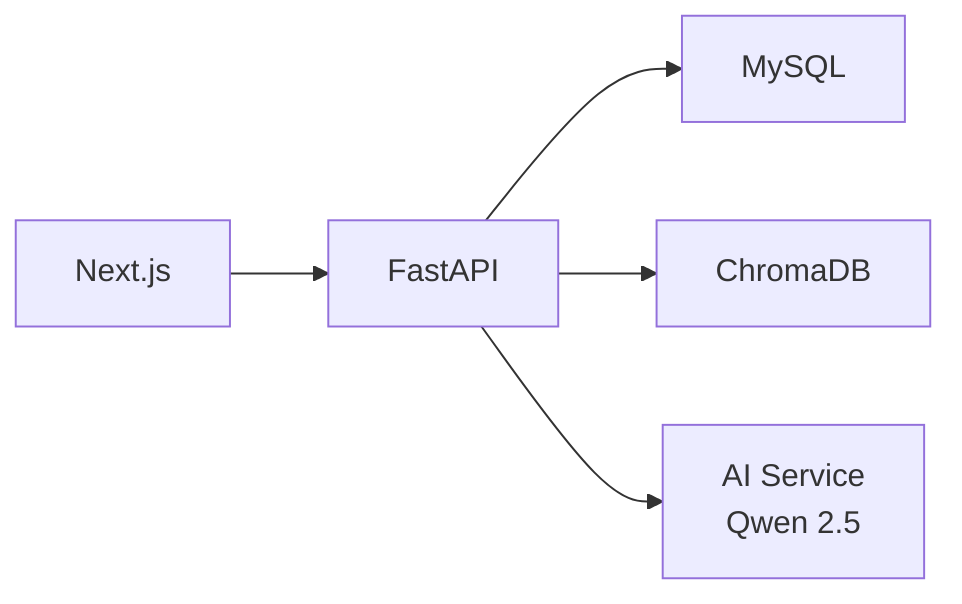

# Chapter 6 – Technical Specification & Development Infrastructure

## 6.1 Technical Overview

This chapter defines the technologies, development standards, software architecture, application programming interfaces, security mechanisms, DevOps workflow, and deployment strategy used in the implementation of WritOath.

It serves as the technical implementation blueprint, providing developers with standardized guidelines for building, testing, deploying, and maintaining the system. The selected technologies emphasize scalability, maintainability, affordability, and compatibility with modern software engineering practices.

---

# 6.2 Technology Stack

The implementation of WritOath utilizes modern open-source technologies selected based on scalability, maintainability, and cost-effectiveness.

| Layer | Technology | Purpose |
| --- | --- | --- |
| Frontend | Next.js (React) | User Interface |
| Backend | FastAPI | REST API & Business Logic |
| Programming Language | Python | Backend & AI Services |
| Database | MySQL | Relational Data Storage |
| Vector Database | ChromaDB | Embedding Storage |
| AI Framework | LangChain | RAG Orchestration |
| LLM | Qwen 2.5 Instruct | Authorship Analysis |
| Embedding Model | Embedding model served via Ollama | Semantic Embeddings |
| Authentication | JWT | Secure Authentication |
| Containerization | Docker & Docker Compose | Environment Consistency |
| CI/CD | GitHub Actions | Automated Testing & Deployment |
| Container Registry | GitHub Container Registry (GHCR) | Docker Image Storage |
| Version Control | Git & GitHub | Source Code Management |
| Frontend Hosting | Vercel | Web Application Deployment |
| Backend Hosting | Railway or Render | Backend API Deployment |
| Monitoring | UptimeRobot & Sentry | Availability & Error Monitoring |

---

# 6.3 Software Architecture Pattern

WritOath follows a layered architecture combined with service-oriented principles.

The application is divided into four major layers:

- Presentation Layer
- Application Layer
- Artificial Intelligence Layer
- Data Layer

Each layer communicates through well-defined interfaces, promoting loose coupling and maintainability.

The AI subsystem further follows an orchestration pattern through the AI Orchestrator, allowing independent AI services to evolve without affecting the rest of the application.

# 6.4 Project Structure

The backend is organized using modular folders that separate API routes, business logic, artificial intelligence services, database operations, and configuration files.

### Backend

```mermaid
backend/
│
├── api/
│   ├── auth.py
│   ├── teachers.py
│   ├── students.py
│   ├── subjects.py
│   ├── papers.py
│   └── analysis.py
│
├── application/
│   ├── services/
│   ├── repositories/
│   └── use_cases/
│
├── ai/
│   ├── orchestrator.py
│   ├── fingerprint_service.py
│   ├── embedding_service.py
│   ├── retrieval_service.py
│   ├── scoring_service.py
│   ├── explanation_service.py
│   └── profile_engine.py
│
├── llm/
│   ├── langchain_pipeline.py
│   ├── prompt_builder.py
│   └── qwen_client.py
│
├── models/
│
├── schemas/
│
├── database/
│
├── config/
│
├── utils/
│
└── main.py
```

### Frontend

frontend/
│
├── app/
│
├── components/
│
├── features/
│   ├── authentication/
│   ├── dashboard/
│   ├── students/
│   ├── subjects/
│   ├── papers/
│   └── analysis/
│
├── services/
│
├── hooks/
│
├── types/
│
└── utils/

---

# 6.5 API Design

The backend exposes RESTful API endpoints that separate authentication, academic management, paper processing, and AI analysis.

## Authentication

| Method | Endpoint | Description |
| --- | --- | --- |
| POST | /api/auth/login | Teacher login |
| POST | /api/auth/logout | Logout |

---

## Students

| Method | Endpoint | Description |
| --- | --- | --- |
| GET | /api/students | Retrieve students |
| POST | /api/students | Register student |
| PUT | /api/students/{id} | Update student |
| DELETE | /api/students/{id} | Remove student |

---

## Subjects

| Method | Endpoint | Description |
| --- | --- | --- |
| GET | /api/subjects | Retrieve subjects |
| POST | /api/subjects | Create subject |
| PUT | /api/subjects/{id} | Update subject |
| DELETE | /api/subjects/{id} | Delete subject |

---

## Papers

| Method | Endpoint | Description |
| --- | --- | --- |
| POST | /api/papers/baseline | Upload verified writing sample |
| POST | /api/papers/analyze | Upload paper for analysis |
| GET | /api/papers/{id} | Retrieve paper |

---

## Analysis

| Method | Endpoint | Description |
| --- | --- | --- |
| GET | /api/analysis/{id} | Retrieve analysis report |
| POST | /api/analysis/{id}/feedback | Teacher validation |

---

# 6.6 Authentication and Security

Authentication is implemented using JSON Web Tokens (JWT).

Upon successful login, the server generates a signed access token that is used to authenticate subsequent API requests.

### Security Best Practices

The system implements several security measures throughout development and deployment.

These include:

- JWT-based authentication
- Password hashing using bcrypt
- HTTPS communication
- Environment-based secret management
- Input validation using Pydantic
- SQL injection prevention through SQLAlchemy ORM
- CORS configuration
- Role-based authorization
- Dependency vulnerability scanning during CI

---

# 6.7 Artificial Intelligence Configuration

The AI subsystem consists of multiple independent services coordinated by the AI Orchestrator.

Configuration parameters include:

| Parameter | Description |
| --- | --- |
| Embedding Model | Model used to generate document embeddings |
| LLM | Open-source language model |
| Retrieval Top-K | Number of writing samples retrieved |
| Maximum Context Length | Prompt context size |
| Similarity Metric | Cosine Similarity |
| Confidence Threshold | Minimum confidence score |
| Profile Version | Current writing profile version |

These parameters may be adjusted without modifying the overall architecture.

---

# 6.8 Development Workflow

To maintain code quality and ensure collaborative development, WritOath adopts a Git Flow Lite branching strategy.

Development is organized into dedicated feature branches that are reviewed and merged into the development branch before being released to production.

The workflow consists of the following branches:

| Branch | Purpose |
| --- | --- |
| main | Production-ready code |
| develop | Integration branch |
| feature/* | New feature development |
| release/* | Version preparation |
| hotfix/* | Production bug fixes |

This workflow enables multiple developers to work simultaneously while minimizing merge conflicts and preserving application stability.

---

### Development Workflow Diagram


---

# 6.9 Continuous Integration (CI)

Every Pull Request automatically triggers the Continuous Integration pipeline.

The CI pipeline performs the following tasks:

1. Checkout the repository.
2. Install project dependencies.
3. Execute backend linting and formatting validation.
4. Execute frontend linting and type checking.
5. Run backend unit tests.
6. Run frontend tests.
7. Execute AI module tests.
8. Build Docker containers.
9. Scan project dependencies and container images for vulnerabilities.
10. Publish test reports.

This process ensures that only verified and tested code may be merged into the development branch.



---

# 6.10 Continuous Deployment (CD)

Once changes are merged into the `main` branch, the Continuous Deployment pipeline automatically deploys the latest production version.

Deployment consists of the following stages:

- Build production Docker images.
- Push Docker images to GitHub Container Registry.
- Deploy FastAPI backend.
- Deploy Next.js frontend.
- Execute database migrations.
- Perform application health checks.
- Notify developers upon successful deployment.

## CD Pipeline



---

# 6.11 Containerization

WritOath uses Docker to ensure consistent development and deployment environments.

The application consists of separate containers for:

- Next.js Frontend
- FastAPI Backend
- MySQL Database
- ChromaDB
- AI Runtime (Ollama)

Using Docker Compose allows developers to initialize the complete development environment using a single command.

```
docker compose up
```

---

## Container Architecture



---

# 6.12 External Dependencies

The following Python libraries are required.

| Library | Purpose |
| --- | --- |
| FastAPI | Backend Framework |
| SQLAlchemy | ORM |
| Alembic | Database Migration |
| LangChain | RAG Framework |
| chromadb-client | Vector Database (HTTP client to the ChromaDB service) |
| httpx | Ollama HTTP client (LLM & embedding inference) |
| Pydantic | Data Validation |
| Passlib | Password Hashing |
| python-jose | JWT Authentication |
| Uvicorn | ASGI Server |

Frontend dependencies include:

- Next.js
- React
- TypeScript
- Tailwind CSS
- Axios
- React Hook Form
- TanStack Query

---

# 6.13 Environment Configuration

The application relies on environment variables to separate configuration from source code.

Example configuration:

```
DATABASE_URL=

JWT_SECRET=

JWT_ALGORITHM=

CHROMA_DB_PATH=

OLLAMA_BASE_URL=

OLLAMA_MODEL=

EMBEDDING_MODEL=

TOP_K=

MAX_CONTEXT=
```

Sensitive information such as database credentials and secret keys should never be committed to version control.

---

# 6.14 Coding Standards

To ensure consistency across the project, the following development standards are adopted.

## Backend

- PEP 8 compliant
- Type hints required
- Async endpoints where applicable
- Dependency injection for services
- Repository pattern for data access
- Service layer for business logic

## Frontend

- Functional React components
- TypeScript for type safety
- Reusable UI components
- Feature-based folder organization
- Consistent naming conventions

### Code Quality Tools

The project uses automated quality tools integrated into the CI pipeline.

| Tool | Purpose |
| --- | --- |
| Ruff | Python Linting |
| Black | Python Formatting |
| MyPy | Static Type Checking |
| ESLint | JavaScript/TypeScript Linting |
| Prettier | Code Formatting |
| Pytest | Backend Testing |
| Vitest | Frontend Testing |
| Trivy | Security Scanning |

---

# 6.15 Logging and Monitoring

The system records structured logs for authentication events, AI analysis requests, retrieval operations, validation actions, and application errors.

Production monitoring utilizes:

- **Sentry** for application error tracking.
- **UptimeRobot** for availability monitoring.

These services enable rapid detection and resolution of production issues.

---

# 6.16 Performance Considerations

To support the expected deployment of 5–10 teachers and 100–200 students, the system incorporates several optimization strategies:

- Database indexing for frequently queried fields
- Vector similarity search through ChromaDB
- Efficient document retrieval using Top-K search
- Asynchronous request handling in FastAPI
- Modular AI services for independent optimization
- Lightweight open-source models suitable for affordable deployment

These measures ensure responsive performance while maintaining a low operational cost.

---

# 6.17 Deployment Strategy

The production deployment architecture consists of independently deployable services.

| Component | Platform |
| --- | --- |
| Frontend | Vercel |
| Backend | Railway or Render |
| MySQL | Railway MySQL |
| ChromaDB | Docker Container |
| AI Runtime | Ollama |
| CI/CD | GitHub Actions |
| Container Registry | GitHub Container Registry |

This architecture enables independent scaling of the frontend, backend, and AI inference services while maintaining low operational costs suitable for the project's expected user base.